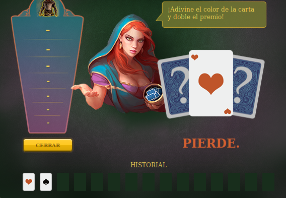

# Tabla de Contenido

* [Alarma](#alarma)
  * [Características](#características)
  * [Requisitos](#requisitos)
  * [Instalación de Alarma](#instalación-de-alarma)
  * [Guía de uso](#guía-de-uso)
* [Rueba de la Fortuna](#rueda-de-la-fortuna)

## Alarma

[](https://www.codacy.com/app/argorar/Imperia-Scripts?utm_source=github.com&amp;utm_medium=referral&amp;utm_content=argorar/Imperia-Scripts&amp;utm_campaign=Badge_Grade)

Alarma que se activa con ataques personales superiores a 999 soldados, re-diseñada para V6.

### Características
* [Sonido](https://freesound.org/data/previews/254/254819_4597795-lq.mp3)
* Auto-recarga para evitar retrasos con el servidor
* Notificaciones de activación de la Alarma (Se requiere previa autorización)


### Requisitos
Se requiere tener instalado Tampermonkey.
* Si usas [Chrome](https://tampermonkey.net/?ext=dhdg&browser=chrome)
* Si usas [Firefox](https://tampermonkey.net/?ext=dhdg&browser=firefox)

### Instalación de Alarma
[Click para Instalar](https://argorar.github.io/Imperia-Scripts/ImperiaAlarm.user.js)

### Guía de uso
A tener en cuenta; después de la instalación no es necesario activar la alarma manualmente, cada vez que se inicie sesión la alarma se activará.
Para garantizar el correcto funcionamiento se recomienta **no tener más pestañas** junto con el juego, ya que los navegadores pueden interrumpir el funcionamiento del script.

**Ejemplo**


## Rueda de la fortuna
Con los siguientes pasos se puede realizar varios intentos de doblar el premio de la rueda de la fortuna por medio del juego de azar de las cartas. **No gasta Diamantes.**

* **Primer paso:** Abrir la taberna

  

  Abrir la consola del navegador web *(clic derecho > inspeccionar elemento > consola)*. Pegar y ejecutar *(tecla enter)* el siguiente código.

  ```console
  draggedWheel = true;
  if (HAS_FLASH) {
    flash.call('wheel').spin();
  } else {
    Wheel.loopAnimation();
  }
  $.post('json.php', {
    controller: 'WheelOfFortune',
    action: 'doSpin'
  }, function(data) {
    if (HAS_FLASH) {
      data['callbackName'] = 'spinCallback';
      flash.call('wheel').win(JSON.stringify(data));
    } else {
      Wheel.setWinner(data.win, data.spinCount, spinCallback, data);
    }
  }, 'json').fail(function() {
  });
  ```
* **Segundo paso:** Después de obtenido el premio, jugar a las cartas para doblar el resultado.

  

   Cuando se pierde, cerrar la venta de las cartas de la **X** de la parte suerior derecha, volver a ejecutar el código del paso anterior *(Esto devuelve el resultado del premio original, cambiando de 0 espías por perder el juego a 20 espías, el premio original para poder volver a jugar a las cartas)*.

   

   Se recomienda repetir ese paso hasta cuatro veces.

   

   Para finalizar, tomar el premio; en este ejemplo se triplico el resultado.

* **Tercer paso: (Opcional)** En caso de que el bóton de selección de las cartas (rojo y negro) no sea visible, ejecutar el código en la consola correspondiente a cada carta.

  **Rojo**
  ```console
  javascript:void(xajax_doChooseCard('modal',{'parentWinID': 'TavernContent','gType':'YjAwZmM4MzFkZjIxOTU3ZjIwYzI0NmE5NzIxYzE4MTA=','cType':1}))
  ```

  **Negro**
  ```console
  javascript:void(xajax_doChooseCard('modal',{'parentWinID': 'TavernContent','gType':'YjAwZmM4MzFkZjIxOTU3ZjIwYzI0NmE5NzIxYzE4MTA=','cType':2}))
  ```
